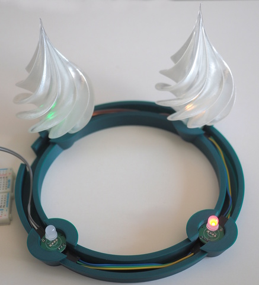
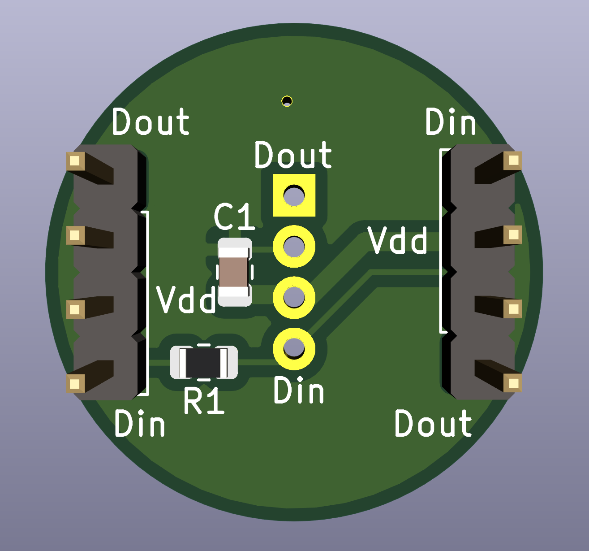

Adventskranz mit Baumornament
=============================

In diesem Projekt geht es um einen Adventskranz aus dem 3D-Drucker.
Statt Kerzen kommen Baum-Ornamente zum Einsatz.

3D-Modelle
----------

Das Modell des Baums (`3D/Ornament.stl.gz`) ist von
<https://www.thingiverse.com/thing:2705104>. Mein Remix
(`3D/Ornament-mit-Basis.stl.gz`) fügt einen
kleinen Stamm hinzu sowie ein Loch im Boden. Das dazugehörige
OpenScad-Programm gibt es auch im Verzeichnis `3D`.
N.B: beide STL-Dateien sind mit gzip komprimiert.

Gedruckt ist das Ornament im Vasenmodus mit naturfarbenem PET. Die
Druckdauer beträgt ca. 2 Stunden pro Ornament (0.2mm Schichtdicke).

Der Kranz ist mit OpenScad entworfen und benötigt 6 Stunden Druckzeit.
Zusätzlich gibt es noch Abdeckungen für die Kabelkanäle. Davon
sind vier notwendig, eine Abdeckung hat einen passenden Ausschnitt
für die Kabelzuführung.

Die Toleranzen sind sehr gering, je nach Drucker und Material
ist hier eine Anpassung notwendig. Dank OpenScad ist das auch
ohne große Vorkenntnisse leicht möglich.

Hardware-Setup
--------------

Das Projekt verwendet diffuse 8mm Neopixels von Adafruit, siehe
<https://www.adafruit.com/product/1734>. Ähnliche LEDs gibt es
auch auf eBay. Die Ansteuerung ist i.a.R. gleich, das Pinout
aber nicht.

Jedes Pixel benötigt einen 100nF-Kondensator, das erste Pixel
zusätzlich noch einen 300 Ohm Widerstand in der Datenleitung.

Neopixel benötigen normalerweise 5V (Versorgungsspannung und auf
der Datenleitung). Bei vier Pixel funktioniert es aber i.a.R. auch
mit 3V3. Alle Details zu Neopixel gibt es in dem umfassenden
Handbuch von Adafruit
(<https://learn.adafruit.com/adafruit-neopixel-uberguide>).

Platine
-------

Im Verzeichnis `pcb` gibt es die KiCAD-Quellen für eine passende
Platine. Die Dimensionen der Platine sind exakt auf den Kranz
abgestimmt. Die Miniplatine enthält den Kondensator und den
Widerstand, wobei das Layout so ist, dass die Platine mit oder
ohne Widerstand verwendet werden kann.

Python-Quellen
--------------

Das Verzeichnis `src_python` enthält ein CircuitPython-Programm für
die Steuerung. Das Programm verwendet einen Taster für das Schalten
der LEDs.

Eine Alternativimplementation ist im Verzeichnis `src_python__sr04`.
Hier kommt ein Distanz-Sensor (HC-SR04) statt des Tasters zum Einsatz.

Die vom Projekt mitgelieferten Libs sind auf dem 7.x-Stand und mit
Circuit-Python 7.0.0 für den Raspberry Pi Pico getestet.

Attiny85-Quellen
----------------

Im Verzeichnis `src_attiny85` gibt es den Quellcode als C-Programm.
