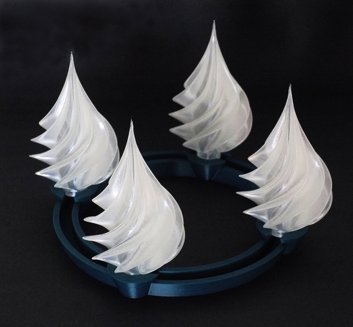

Adventskranz mit Baumornament
=============================

***Achtung: die Inhalte sind aktuell nur rudimentär vorhanden***

In diesem Projekt geht es um einen Adventskranz aus dem 3D-Drucker.
Statt Kerzen kommen Baum-Ornamente zum Einsatz.

3D-Modelle
----------

Das Modell des Baums (`3D/Ornament.stl`) ist von
<https://www.thingiverse.com/thing:2705104>. Mein Remix
(`3D/Ornament-mit-Basis.stl`) fügt einen
kleinen Stamm hinzu sowie ein Loch im Boden. Das dazugehörige
OpenScad-Programm gibt es auch im Verzeichnis `3D`.

Gedruckt ist das Ornament im Vasenmodus mit naturfarbenem PET. Die
Druckdauer beträgt ca. 2 Stunden (0.2mm Schichtdicke).

Der Kranz ist mit OpenScad entworfen und benötigt 6 Stunden Druckzeit.

Hardware-Setup
--------------

Das Projekt verwendet diffuse 8mm Neopixels von Adafruit, siehe
<https://www.adafruit.com/product/1734>. 

Jedes Pixel benötigt einen 100nF-Kondensator, das erste Pixel
zusätzlich noch einen 300 Ohm Widerstand in der Datenleitung.

Neopixel benötigen normalerweise 5V (Versorgungsspannung und auf
der Datenleitung). Bei vier Pixel funktioniert es aber i.a.R. auch
mit 3V3. Alle Details zu Neopixel gibt es in dem umfassenden
Handbuch von Adafruit
(<https://learn.adafruit.com/adafruit-neopixel-uberguide>).

Platine
-------

Im Verzeichnis `pcb` gibt es die KiCAD-Quellen für eine passende
Platine. Die Dimensionen der Platine sind exakt auf den Kranz
abgestimmt.

Python-Quellen
--------------

Im Verzeichnis `src_python` gibt ein CircuitPython-Programm für
die Steuerung.

Attiny85-Quellen
----------------

Im Verzeichnis `src_attiny85` gibt es den Quellcode als C-Programm.
